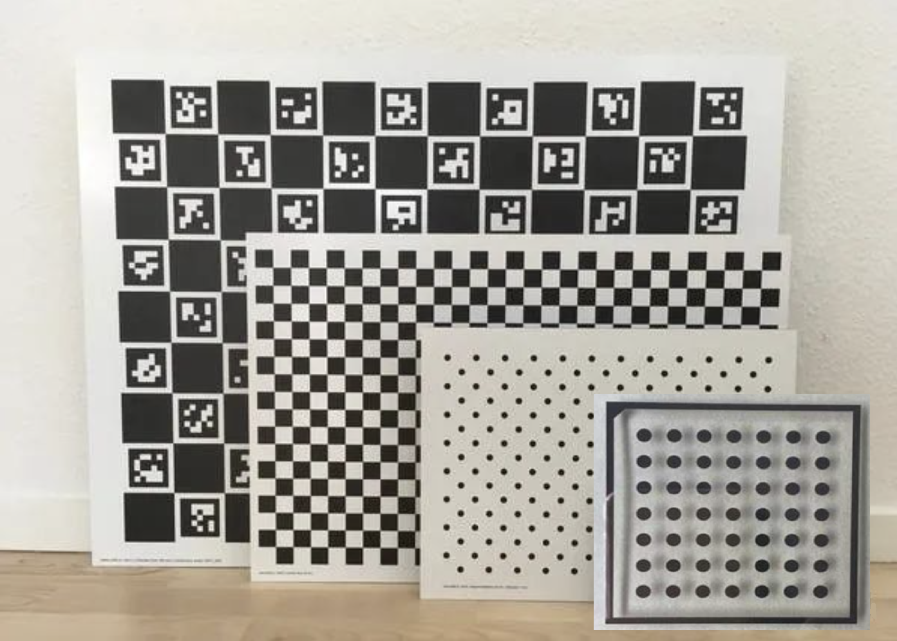

# 相机标定

## 一、依赖与安装

### 1.1 依赖与环境

`OpenCV` + `windows or ubuntu`

### 1.2 生成

```
mkdir build && build
cmake ..
make
```

### 1.3 demo

* 单目棋盘格标定

`./chessboard_calib ../imgs/chessboard/ ../imgs/chessboard/`

* 单目对称圆点标定

`./circle_board_calib` 

**注意:** 

1. 对于圆点标定板，需要用BLOB斑点检测器检测斑点，进而获取圆心。然而Blob检测器检测正确与否**非常依赖检测参数的设置**。
2. 对OpenCV API	`calibrateCamera`可以设置标定算法选项，引入若干先验，比如固定k3=0，固定光心，固定p1,p2=0等。


## 二、介绍

相机标定本质上是设计R<sup>3</sup>中已知尺寸的平面图案，使得其投影到图像后特征点具有显著性，容易被算法检测。接着通过构造三维空间和图像中的3D-2D匹配点对，计算投影矩阵H<sub>i</sub> = K[r1<sub>i</sub>, r2<sub>i</sub>, t<sub>i</sub>] (令平面上点在世界坐标系中Z=0）。接着可以利用r1,r2的正交约束和归一化约束，一个投影矩阵得到两个方程：

1. h2i</sub>K<sup>-T</sup>K<sup>-1</sup>h1<sub>i</sub> = 0

2. h1<sub>i</sub>K<sup>-T</sup>K<sup>-1</sup>h1<sub>i</sub> = h2<sub>i</sub>K<sup>-T</sup>K<sup>-1</sup>h2<sub>i</sub> 

由于内参具有5个未知量，因此至少需要三幅正确检测特征点的图像。求出内参后，用LM非线性优化算法计算畸变参数。

常见的相机标定板有四种，分别是棋盘格，对称圆点标定板、非对称圆点标定板和ChArUco板。对应特征点检测算法分别检测角点(鞍点)、投影椭球中心、投影椭球中心、棋盘格与ArUco的角点。

<p align="center"></p>

<h6 align="center">从外到内分别是对称圆点、非对称圆点、棋盘格和ChArUco标定板</h6>

OpenCV支持四种标定板的标定(Matlab2021之前的版本只支持棋盘格)，本仓库代码是C++ OpenCV对应官方标定例子的总结。

## 三、参考资料

[1] [OpenCV对称圆点标定](https://blog.csdn.net/weixin_51229250/article/details/120009716)

[2] [CSDN-ChArUco](https://blog.csdn.net/zhy29563/article/details/119039163)

